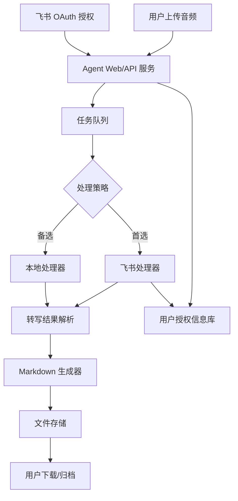
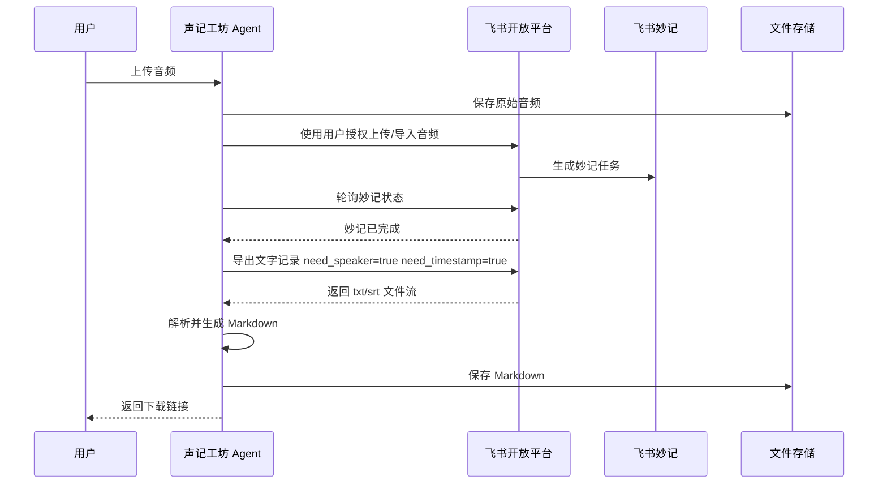
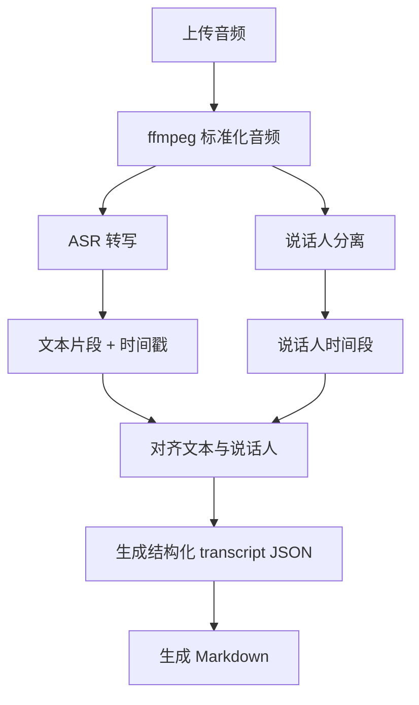
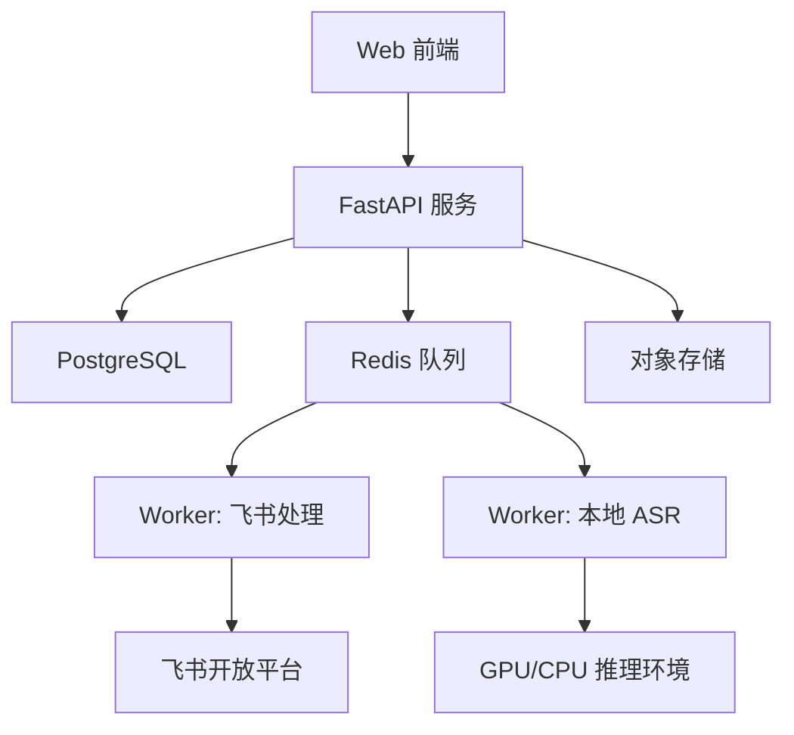

# 声记工坊：公司公共音频转 Markdown Agent 策划书与技术说明

## 一、项目背景

公司内部会议、客户交流、访谈、培训、评审等场景中，经常会产生大量音频资料。这些音频通常包含重要信息，但原始音频不便于检索、复用和沉淀，后续整理会议纪要、客户需求、问题清单、行动项时需要投入大量人工时间。

目前飞书妙记已经具备音视频转写、逐字稿、说话人标记、时间戳和导出能力。飞书开放平台也提供了妙记文字记录导出接口，可在导出时携带说话人和时间戳参数，返回文字记录文件。 因此，本项目优先复用飞书妙记能力，将其封装为公司公共 Agent，降低个人手工上传、转写、导出、整理 Markdown 的操作成本。

同时，为了避免完全依赖飞书能力，本项目设计本地备选方案。当飞书授权不可用、妙记处理失败、音频不适合进入飞书、或未来需要私有化部署时，可使用本地 ASR 与说话人分离方案完成基础转写。pyannote.audio 是基于 PyTorch 的开源说话人分离工具包，提供预训练模型和说话人分离流水线，可作为本地备选方案的重要组件。

## 二、项目名称

中文名：声记工坊
英文名：VoiceNote Forge

名称含义：

“声记”表示从声音生成文字记录，“工坊”表示统一的自动化加工流水线。项目不是简单的录音转文字工具，而是一个面向公司知识沉淀的音频处理 Agent，能够把会议录音、访谈音频、评审讨论等材料转化为结构化 Markdown 文档。

## 三、项目目标

本项目目标是建设一个公司公共 Agent，支持员工上传音频文件，系统自动完成转写、说话人标记、时间戳处理、文本清洗和 Markdown 导出。

核心目标包括：

1. 降低会议音频整理成本。
2. 统一公司内部会议记录与音频转写格式。
3. 支持多人使用，每个员工使用自己的飞书账号授权。
4. 优先使用飞书妙记，最大化复用飞书已有转写与说话人识别能力。
5. 提供本地备选路线，满足飞书不可用、隐私要求更高或离线处理场景。
6. 输出 Markdown 文件，便于进入知识库、Git 仓库、飞书文档、Obsidian 或其他文档系统。

## 四、产品定位

声记工坊是一个“音频转 Markdown”的公司公共 Agent。

它不是单纯的 ASR 工具，而是一个面向企业工作流的音频资料结构化工具。

输入：

* 本地音频文件
* 会议录音文件
* 培训录音
* 客户交流录音
* 访谈录音
* 其他常见音视频文件

输出：

* 原始逐字稿 Markdown
* 带说话人标记的 Markdown
* 带时间戳的 Markdown
* 可选会议纪要 Markdown
* 可选行动项、决议、客户重点发言、问题清单等结构化内容

首选处理路线：

音频文件 → 飞书账号授权 → 飞书妙记处理 → 导出带说话人和时间戳的转写文本 → 转换为 Markdown

备选处理路线：

音频文件 → 本地 ASR 转写 → 本地说话人分离 → 文本与说话人对齐 → 转换为 Markdown

## 五、典型使用场景

### 1. 客户会议整理

员工上传客户会议录音，系统输出：

* 原始逐字稿
* 客户重点发言
* 需求点
* 问题点
* 待办事项
* 后续跟进建议

### 2. 内部评审会议整理

员工上传内部评审录音，系统输出：

* 按说话人整理的发言记录
* 关键争议点
* 评审结论
* 风险项
* 行动项

### 3. 培训与分享内容沉淀

员工上传培训音频，系统输出：

* 培训内容逐字稿
* 章节化笔记
* 知识点摘要
* 可检索 Markdown 文件

### 4. 访谈与调研资料整理

员工上传访谈录音，系统输出：

* 问答式记录
* 被访谈人原话摘录
* 观点总结
* 主题归类

## 六、用户流程

### 6.1 首次使用流程

1. 用户进入声记工坊 Agent 页面。
2. 系统提示用户绑定飞书账号。
3. 用户通过飞书 OAuth 授权。
4. 系统保存该用户的授权信息。
5. 用户上传音频文件。
6. 系统使用该用户的飞书身份调用飞书能力。
7. 飞书妙记处理完成后，系统导出文字记录。
8. 系统生成 Markdown 文件。
9. 用户下载或保存到指定位置。

### 6.2 日常使用流程

1. 用户上传音频。
2. 选择处理模式：

   * 飞书优先
   * 本地处理
   * 自动选择
3. 选择输出格式：

   * 原始逐字稿
   * 会议纪要
   * 原始逐字稿 + 会议纪要
4. 系统自动处理。
5. 用户获得 Markdown 文件。

### 6.3 管理员流程

1. 管理员创建飞书开放平台应用。
2. 配置 OAuth 回调地址。
3. 配置妙记、云文档、文件上传等权限。
4. 配置 Agent 服务地址。
5. 配置文件存储、日志、任务队列。
6. 管理用户授权状态和任务运行情况。

## 七、核心功能规划

### 7.1 音频上传

支持用户上传常见音频格式，例如：

* mp3
* wav
* m4a
* aac
* mp4 音视频文件

上传后系统生成任务 ID，并将音频暂存到对象存储或服务器临时目录。

### 7.2 飞书账号授权

每个用户使用自己的飞书账号授权。系统不共用单一账号处理所有人的音频。

这样设计的好处是：

1. 符合飞书权限模型。
2. 用户只能访问自己有权限的妙记和文档。
3. 便于审计。
4. 避免公共账号权限过大。
5. 便于后续按用户归档。

### 7.3 飞书优先处理

飞书路线是项目首选路线。

处理逻辑：

1. 系统接收音频文件。
2. 使用用户授权信息调用飞书相关能力。
3. 将音频导入飞书侧处理，生成妙记。
4. 轮询妙记处理状态。
5. 妙记完成后导出文字记录。
6. 导出时启用说话人和时间戳。
7. 将导出的 txt 或 srt 转换为结构化 Markdown。

飞书开放平台的妙记文字导出接口支持通过 `need_speaker` 和 `need_timestamp` 控制是否包含说话人和时间戳，接口成功时返回文件二进制流。 这正好匹配本项目“带说话人标记的 Markdown 输出”需求。

### 7.4 本地备选处理

当飞书路线不可用时，系统切换到本地处理。

本地路线包括：

1. 音频预处理。
2. ASR 语音识别。
3. 说话人分离。
4. 文本与说话人时间段对齐。
5. Markdown 生成。

推荐技术组合：

* ASR：Whisper / faster-whisper / WhisperX
* 说话人分离：pyannote.audio
* 音频处理：ffmpeg
* 文本整理：LLM 或规则引擎
* Markdown 渲染：Jinja2 模板

pyannote.audio 是一个开源说话人分离工具包，提供语音活动检测、说话人变化检测、重叠语音检测和说话人嵌入等组件。 Whisper 与 pyannote.audio 组合也已有开源项目实践，用于同时完成转写和说话人分离。

### 7.5 Markdown 导出

默认输出两个 Markdown 文件：

1. `transcript.md`：尽量忠实保留原始逐字稿。
2. `minutes.md`：经过整理后的会议纪要。

也可以只输出一个标准文件：

`音频文件名_转写记录.md`

建议默认结构如下：

```md
# {{会议标题或音频文件名}}

- 来源文件：{{audio_filename}}
- 处理方式：{{feishu 或 local}}
- 处理时间：{{processed_at}}
- 音频时长：{{duration}}
- 说话人数量：{{speaker_count}}

---

## 一、会议概要

{{summary}}

---

## 二、关键结论

{{decisions}}

---

## 三、待办事项

| 序号 | 事项 | 负责人 | 截止时间 | 备注 |
|---|---|---|---|---|
| 1 | {{todo}} | {{owner}} | {{deadline}} | {{note}} |

---

## 四、原始发言记录

### 00:01:23 说话人 A

{{content}}

### 00:02:15 说话人 B

{{content}}
```

### 7.6 说话人映射

飞书或本地方案可能只能识别为：

* 说话人 1
* 说话人 2
* Speaker A
* Speaker B

系统应提供说话人映射能力：

```yaml
speaker_map:
  说话人1: 杜
  说话人2: 客户A
  说话人3: 技术负责人
```

用户可以在输出前或输出后修改映射，系统重新生成 Markdown。

### 7.7 任务状态管理

每个音频处理任务应包含以下状态：

* 已上传
* 等待处理
* 飞书上传中
* 飞书转写中
* 飞书导出中
* 本地转写中
* Markdown 生成中
* 处理完成
* 处理失败
* 等待用户授权
* 权限不足
* 文件格式不支持

## 八、技术架构

### 8.1 总体架构



### 8.2 主要模块

| 模块           | 说明                        |
| ------------ | ------------------------- |
| Web/API 服务   | 提供上传、授权、任务查询、文件下载接口       |
| OAuth 授权模块   | 管理用户飞书授权流程                |
| 任务队列         | 异步处理长音频任务                 |
| 飞书处理器        | 调用飞书能力生成妙记并导出文字           |
| 本地处理器        | 调用本地 ASR 和说话人分离模型         |
| 转写解析器        | 将 txt、srt、json 等结果统一为内部结构 |
| Markdown 生成器 | 使用模板生成标准 Markdown         |
| 文件存储         | 保存原始音频、中间结果、Markdown 输出   |
| 审计日志         | 记录上传、处理、下载、失败原因等操作        |

### 8.3 推荐技术栈

| 层级          | 推荐方案                           |
| ----------- | ------------------------------ |
| 前端          | Next.js / Vue / 简单内部管理页        |
| 后端          | Python FastAPI                 |
| 任务队列        | Celery + Redis / RQ / Dramatiq |
| 数据库         | PostgreSQL / SQLite MVP        |
| 文件存储        | 本地磁盘 / MinIO / S3 兼容对象存储       |
| 飞书接口        | 飞书开放平台 OAuth + Minutes API     |
| 本地 ASR      | faster-whisper / WhisperX      |
| 说话人分离       | pyannote.audio                 |
| 音频处理        | ffmpeg                         |
| Markdown 模板 | Jinja2                         |
| 部署          | Docker Compose / Kubernetes    |

## 九、飞书路线技术说明

### 9.1 飞书应用类型

建议创建公司内部自建应用。

原因：

1. 便于公司内部员工使用。
2. 权限范围可控。
3. 支持统一配置 OAuth。
4. 便于后续扩展机器人、飞书文档归档、消息通知等能力。

### 9.2 授权模式

建议采用用户身份授权。

每个员工首次使用时，需要授权自己的飞书账号。系统保存 access token / refresh token，并在任务执行时使用该用户身份调用飞书能力。

这样可以避免所有任务都绑定到管理员账号，也能减少越权风险。

### 9.3 飞书处理流程



### 9.4 飞书关键能力

1. 文件上传能力
   飞书开放平台提供云空间文件上传接口，可将指定文件上传至云空间指定目录。该接口支持自建应用和商店应用，但普通上传接口有文件大小限制，例如文档显示上传文件大小不得超过 20MB，且有调用频率限制。 因此，实际开发时需要确认是否使用分片上传、云空间导入、妙记专用上传或其他更适合大音频文件的接口。

2. 妙记文字导出能力
   飞书开放平台提供妙记文字记录导出接口，可通过 `minute_token` 导出 txt 或 srt，并可指定是否包含说话人和时间戳。

3. 错误处理
   妙记导出接口可能返回妙记未就绪、权限不足、资源不存在、资源已删除等错误。飞书文档明确列出了 `minute not ready`、`permission deny`、`resource not found` 等错误场景。 系统应针对这些错误提供清晰提示和自动重试机制。

### 9.5 实际部署验证结果（2026-07 阿里云生产环境）

本项目已完成阿里云生产环境部署,以下为飞书路线的实测结论,补充文档原先的"需要重点验证"问题:

1. **必需的 OAuth scope（权限名易错点）**

   飞书妙记的权限域是 `minutes:minutes.*`（**双 s**），不是 `minutes:minute.*`（单数）。实际需要在飞书开发者后台开通的核心权限为:

   | 权限名 | 中文名 | 用途 |
   | ----- | ----- | ---- |
   | `minutes:minutes.basic:read` | 获取妙记的基本信息 | 通过 `minute_token` 查询妙记元数据（标题等） |
   | `minutes:minutes.transcript:export` | 导出妙记转写的文字内容 | **核心权限**,缺失会报错 99991679 / 20027 |

   ⚠️ **重要易错点**：飞书错误信息 `99991679` / `20027` 报错时返回的 `minutes:minute:download` 这个权限名**实际并不存在**，是飞书错误信息的误导。飞书后台可开通的正确权限名是 `minutes:minutes.transcript:export`（注意双 `s`）。

   在开发者后台搜索权限时,**关键词应该用 "妙记" 或 "minutes",不要用 "meeting"**(后者只能搜到 `vc:meeting` 视频会议域的权限)。

2. **权限生效的两个必要步骤**

   - **发布新版本**:仅在权限管理页勾选是不够的,必须在「版本管理与发布」创建版本并发布,权限才会生效。
   - **用户重新授权**:权限变更后,已经绑定飞书的旧用户 access_token 仍然没有新权限,必须让用户解绑后重新走 OAuth 流程换取带新 scope 的 token。

3. **飞书妙记实际转写格式（parser 需要适配）**

   飞书妙记导出接口返回的转写文本格式与常见格式不同,parser 需要专门适配:

   ```
   说话人 1 00:00:01.700
   说话人 1 的发言内容...

   说话人 2 00:00:15.200
   说话人 2 的发言内容...
   ```

   特点:
   - 说话人在前,时间戳在后（传统格式是时间戳在前）
   - 时间戳不带方括号,带毫秒（`00:00:01.700`）
   - 内容在下一行单独成段（传统格式是同一行用冒号分隔）

   本项目的 `parser.py` 已同时支持飞书格式和传统 `[HH:MM:SS] 说话人: 内容` 格式,优先尝试飞书格式,回退到传统格式。

4. **静态资源缓存策略（cache busting）**

   生产环境通过 Cloudflare CDN 加速时,JS/CSS 会被 CDN 缓存。代码更新后如果 URL 不变,CDN 仍返回旧版 JS,导致前端 bug 难以排查。

   本项目采用行业标准的 cache busting 机制:服务启动时读取 git commit hash,自动注入到 `index.html` 的静态资源 URL（如 `app.js?v=9ae1a33`）。每次部署 commit hash 变化,URL 自动变化,CDN 视为新文件不命中旧缓存。

   配置位置:
   - `main.py` 的 `_get_app_version()` 和 `_render_index_html()` 函数
   - `static/index.html` 中的 `?v=__APP_VERSION__` 占位符

5. **关于"上传音频生成妙记"接口**

   实际部署采用方式 B（半自动兜底方式）:用户在飞书妙记中上传音频生成妙记,系统通过 Webhook 接收妙记生成事件 `minutes.minute.generated_v1`,自动触发导出。该方案已验证可稳定工作,无需依赖可能受限的"音频文件 → 创建妙记"接口。

### 9.6 需要重点验证的问题

飞书路线最大的关键点是：

**是否存在稳定、可公开调用的“音频文件 → 创建妙记”的开放接口。**

目前公开文档中明确的是“导出妙记文字记录”能力；而“上传本地音视频并生成妙记”在产品能力上存在，但具体可用接口、权限和限制需要进一步实测确认。第三方飞书妙记工具和 Skill 已经提到支持本地音视频生成妙记，但正式项目中应以飞书开放平台实际授权和接口测试结果为准。

因此 MVP 应设计两种飞书接入方式：

方式 A：全自动方式
用户上传音频后，系统自动导入飞书生成妙记，再导出文字。

方式 B：半自动兜底方式
如果全自动导入妙记暂时不可用，则用户先在飞书妙记中上传音频生成妙记，系统再通过妙记 token 导出文字并生成 Markdown。

## 十、本地备选路线技术说明

### 10.1 本地处理流程



### 10.2 本地方案推荐组合

| 能力       | 推荐组件           | 说明               |
| -------- | -------------- | ---------------- |
| 音频转码     | ffmpeg         | 统一采样率、声道、格式      |
| ASR      | faster-whisper | 推理速度较好，适合服务器部署   |
| ASR + 对齐 | WhisperX       | 更适合需要词级/句级时间戳的场景 |
| 说话人分离    | pyannote.audio | 开源说话人分离工具包       |
| 文本清洗     | LLM / 规则       | 修正标点、合并短句、去口癖    |
| Markdown | Jinja2         | 模板化输出            |

### 10.3 本地方案限制

本地方案可以解决“飞书不可用”的问题，但它不是第一优先级，原因如下：

1. 说话人分离不等于真实身份识别，只能识别为 Speaker 1、Speaker 2。
2. 多人同时说话、远程会议噪声、回声、低质量录音会影响效果。
3. 中文、日文、英文混杂时，需要实测 ASR 模型表现。
4. 长音频处理需要 GPU 或较长 CPU 时间。
5. 本地模型部署和升级需要维护成本。

### 10.4 本地方案适合场景

1. 音频涉密，不希望上传飞书。
2. 飞书授权失败。
3. 飞书妙记接口不可用。
4. 用户只需要粗略逐字稿。
5. 公司未来希望做私有化部署。

## 十一、部署方式

本项目支持两种运行形态。

### 11.1 云端运行

云端运行是公司公共 Agent 的推荐形态。

特点：

1. 所有员工访问统一网址。
2. 用户在网页上授权飞书账号。
3. 用户上传音频。
4. 服务端统一处理任务。
5. 结果可统一归档和审计。
6. 便于后续接入公司知识库。

推荐部署结构：



适合部署在：

* 公司云服务器
* 阿里云 / 腾讯云 / AWS
* 内部 Kubernetes
* Docker Compose 单机服务器

### 11.2 本地运行

本地运行适合隐私要求更高或网络受限场景。

方式：

1. 用户本地启动客户端或 CLI。
2. 本地上传音频到本机服务。
3. 可选择使用用户自己的飞书授权。
4. 也可选择完全本地 ASR。
5. 输出 Markdown 到本地目录。

本地运行优点：

1. 原始音频不离开用户电脑。
2. 可满足临时离线处理。
3. 适合敏感会议录音。

本地运行缺点：

1. 部署门槛高。
2. 每个用户环境不一致。
3. 本地模型运行速度取决于电脑性能。
4. 不便于统一管理。

### 11.3 推荐部署策略

第一阶段采用云端运行。

第二阶段提供本地 CLI 或桌面端作为补充。

推荐策略：

```text
默认：云端公共 Agent + 飞书优先
补充：云端公共 Agent + 本地模型 Worker
高级：用户本地 CLI + 本地模型
```

## 十二、权限与安全设计

### 12.1 用户授权隔离

每个用户绑定自己的飞书账号。系统按用户保存授权信息，并在任务执行时使用对应用户 token。

### 12.2 文件隔离

用户只能访问自己上传的音频和生成的 Markdown。

管理员可以配置是否允许查看用户任务，但默认不应直接暴露原始音频内容。

### 12.3 原始音频保留策略

建议默认策略：

* 原始音频保留 7 天。
* 中间转写文件保留 30 天。
* Markdown 文件长期保留，或由用户手动下载后删除。
* 敏感任务支持“处理完成后立即删除原始音频”。

### 12.4 日志策略

日志只记录：

* 用户 ID
* 任务 ID
* 文件名
* 文件大小
* 处理模式
* 成功/失败状态
* 错误码
* 时间戳

日志不记录完整音频内容和完整转写正文。

### 12.5 Token 安全

飞书 access token 和 refresh token 应加密存储。

建议：

1. 数据库存储密文。
2. 使用服务端密钥加密。
3. 密钥放入环境变量或密钥管理服务。
4. 定期刷新 token。
5. 用户可主动解除授权。

## 十三、MVP 范围

### 13.1 MVP 必须实现

1. 用户登录。
2. 用户绑定飞书账号。
3. 上传音频文件。
4. 创建处理任务。
5. 优先调用飞书路线处理。
6. 导出带说话人和时间戳的文字记录。
7. 生成标准 Markdown。
8. 下载 Markdown。
9. 任务状态查询。
10. 失败原因提示。

### 13.2 MVP 可以暂缓

1. 自动生成正式会议纪要。
2. 自动提取待办事项。
3. 飞书文档自动归档。
4. Git 仓库自动提交。
5. 企业知识库同步。
6. 本地桌面端。
7. 用户自定义模板。
8. 多语言翻译。

### 13.3 MVP 成功标准

1. 用户上传一段音频后，可以在系统中获得 Markdown。
2. Markdown 中包含说话人标记。
3. Markdown 中包含时间戳。
4. 处理失败时，用户能看到明确原因。
5. 至少支持 30 分钟以上会议音频。
6. 支持多人同时提交任务。
7. 普通员工不需要理解飞书妙记后台操作。

## 十四、阶段规划

### 第一阶段：飞书优先 MVP

周期目标：

完成公司公共 Agent 的最小闭环。

功能范围：

* 飞书 OAuth 授权
* 音频上传
* 飞书处理
* 妙记文字导出
* Markdown 生成
* 文件下载

交付物：

* Web 上传页面
* 后端服务
* 飞书授权模块
* Markdown 模板
* 任务状态页面

### 第二阶段：本地备选 Worker

周期目标：

当飞书路线失败时，支持服务器本地转写。

功能范围：

* ffmpeg 音频预处理
* faster-whisper 转写
* pyannote.audio 说话人分离
* 文本与说话人对齐
* 本地 Markdown 输出

交付物：

* 本地 ASR Worker
* 本地处理配置
* GPU/CPU 运行说明
* 本地路线质量评估报告

### 第三阶段：会议纪要增强

周期目标：

从“转写工具”升级为“会议记录整理 Agent”。

功能范围：

* 自动摘要
* 关键结论提取
* 待办事项提取
* 客户发言重点提取
* 按议题整理
* 说话人名称映射

交付物：

* `transcript.md`
* `minutes.md`
* `todo.md`
* 会议记录模板管理

### 第四阶段：知识库归档

周期目标：

将音频资料自动沉淀到公司知识库。

功能范围：

* 飞书云文档归档
* Git 仓库归档
* 项目/客户分类
* 全文搜索
* 权限继承
* 批量处理

交付物：

* 项目目录结构
* 自动归档规则
* 检索页面
* 管理后台

## 十五、风险与应对

### 风险 1：飞书“上传音频生成妙记”接口不可用或权限受限

应对：

1. 优先实测飞书开放平台能力。
2. MVP 保留半自动方案：用户先在飞书中生成妙记，再由系统导出 Markdown。
3. 同步建设本地备选路线。

### 风险 2：长音频文件上传限制

飞书普通文件上传接口存在文件大小限制，公开文档中普通上传接口示例限制为 20MB。 会议音频往往超过该限制，因此需要验证分片上传、云空间大文件上传、妙记专用上传或其他可行方案。

应对：

1. 开发前进行 30 分钟、60 分钟、120 分钟音频实测。
2. 支持服务器端音频压缩。
3. 支持分片上传。
4. 支持失败后切换本地路线。

### 风险 3：说话人标记不准确

应对：

1. 保留原始时间戳。
2. 提供说话人映射功能。
3. 支持人工修正后重新导出。
4. 对整理版和原始版分开保存，避免误改原文。

### 风险 4：LLM 整理产生幻觉

应对：

1. 默认输出原始逐字稿。
2. 整理版必须基于原始逐字稿。
3. 关键结论和待办可以附带原始发言位置。
4. 高风险会议只输出逐字稿，不自动总结。

### 风险 5：数据安全与隐私

应对：

1. 用户授权隔离。
2. 原始音频自动过期删除。
3. Token 加密存储。
4. 日志不记录正文。
5. 敏感任务支持本地模式。

## 十六、推荐优先级

建议按以下顺序推进：

第一优先级：

* 飞书 OAuth
* 音频上传
* 飞书转写
* Markdown 导出

第二优先级：

* 任务队列
* 错误重试
* 说话人映射
* 原始音频自动清理

第三优先级：

* 本地 ASR Worker
* 会议纪要整理
* 飞书文档归档
* 知识库同步

## 十七、结论

声记工坊的核心价值是把公司内部零散音频资料转化为可检索、可归档、可复用的 Markdown 文档资产。

项目首选路线应使用飞书妙记能力，因为飞书已经具备音视频转写、说话人标记和导出能力，且开放平台提供了妙记文字导出接口，可直接导出带说话人和时间戳的文本。

本地方案不应作为第一版主线，而应作为飞书不可用时的补充能力。它可以增强系统独立性和隐私适配能力，但会带来模型部署、识别准确率、说话人分离质量和计算资源成本等问题。

最终推荐路线：

```text
第一版：云端公共 Agent + 用户飞书授权 + 飞书妙记优先 + Markdown 输出

第二版：增加本地 ASR Worker，作为飞书失败或敏感音频的备选路线

第三版：增加 LLM 会议纪要整理、待办提取和知识库归档能力
```
